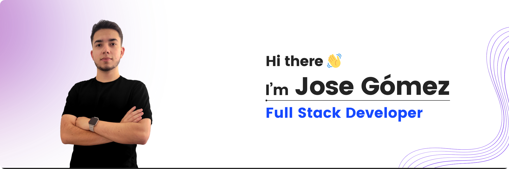

<picture>
  <source media="(prefers-color-scheme: dark)" srcset="./cover-dark.png">
  <source media="(prefers-color-scheme: light)" srcset="./cover.png">
  
</picture>

I'm a Full Stack Developer passionate about learning and creating new things. I'm studying Systems Engineering at the [Universidad de Antioquia](https://www.udea.edu.co).

Here are some of the technologies and tools I've been working with:

## Languages

  

  

  

  

  

  

## Frameworks

  

  

  

  

  

  

## Databases

  
  
  

  

  

  

## Tools

  

  

  

  

  

  

  

  

  

  

  

  

## In Progress

  

  

  

  

  

## Get in touch

Let's connect! You can find me on

  

  

